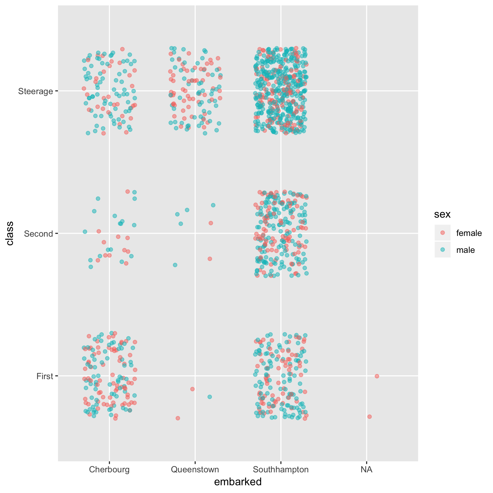
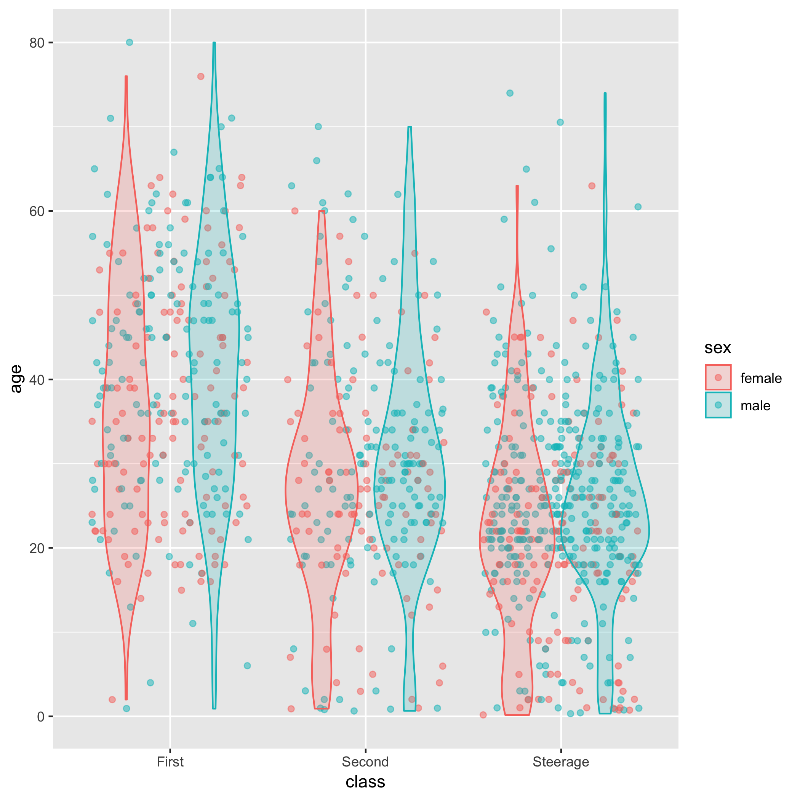

```{r setup, include=FALSE}
library(learnr)
library(mosaic)
library(mosaicData)
library(dplyr)
library(SDSdata)
library(googlesheets)
knitr::opts_chunk$set(echo = FALSE)
```

## Introduction

This tutorial covers the construction of data graphics layers, the type of graphics layer where each row in a data frame becomes one glyph in the graph. We'll  also  make violin-plot layers. In later chapters we'll introduce other statistic layers and interval layers, but that will have to wait until you  know  how to calculate the statistics and intervals themselves.

To review the basic R concepts covered up to this point ...

- An R *name* is consists of unquoted letters and characters that follow simple rules. For example `Titanic_passengers` and `gf_point` are names we'll encounter in this tutorial. Names  are used to refer to the objects involved  in computations.
- A *data frame* is the generic  structure used for storing tidy data. `Titanic_passengers` is  a data frame with 1309 rows and 14 variables including `survived`, `age`, `boat`, and so on. Note that the variables within a data frame themselves have names. As a convention, names for data frames will start with a capital letter, while names of variables will be lower case. 
- An R *function* takes inputs and  produces an  output. When we refer to an R function, we write  the name (e.g. `gf_point`) followed by parentheses (e.g. `gf_point()`) to remind us that the name identifies a function  as opposed to a data frame or a  variable or  something else.
- A *formula* is the means we will use to specify the sorts of relationships between variables we want to examine. A formula  always involves the character *tilde*,  `~`, and generally relates two or more variables. Other symbols  you will see in formulas are `+` and `|`.

## A command template

A satisfyingly high fraction of the R commands we need in statistics follow a simple *template*. Once you know how that template works, starting to use  a new function is relatively easy. 

The template looks like this,  with two arguments  always required:

```
goal_function( y_var ~ x_var, data = data_frame,  ...)
```

You've job  when working  with the  template is 

1. Figure out what computation you want  to carry out and choose the  right `goal_function` to carry it out.  For instance, in  the tutorial on  data you used `df_stats()`  while in this  tutorial you'll use `gf_point()` and `gf_jitter()`.
2. Choose the variables  you want to work  with. In graphics, the `y_var` defines  the  vertical axis and  the `x_yar` defines the horizontal axis. 
3. Determine the name that has been assigned to the data frame  you want to work with.

Many goal functions  require additional arguments providing information about the task. For instance,  when using `df_stats()` in the tutorial on data, we specified `table` and `props` as arguments to tell R to  count rows and find proportions respectively. These additional arguments will be put in  the  place marked by `...` in the template. After a few  examples, you'll get the hang of it.

## Jittered point plots

The  `gf_jitter()` function makes jittered point plots. 

```{r jittered_graphics, exercise = TRUE, exercise.cap = "Point plots."}
gf_jitter(age  ~ class, data = Titanic_passengers)
```

You have a variety of options to  control the  "details" of this plot, which  you do by adding appropriate arguments where the `...` goes in the template. Here  are a few:

- set the color of  the  glyphs: `color = "blue"`
- map the color  of the glyphs to a variable,  that is to say, color the dots differently  according to the value of a variable:  `color = ~ sex` Here,  the `~ sex` is  a formula that involves only one variable, the one to be used to determine the color.
- add transparency to the points: `alpha = 0.5`
- make the jittering narrower: `width = 0.2`

If  you use more than one of these options, remember to separate arguments by commas.


Exercise: Using `gf_jitter()`, make the following graphic in the previous exercise block.

```{r echo = FALSE, out.width = "90%", fig.align="center"}

```

```{r target_for_exercise, eval = FALSE, echo = FALSE}
# run this once to create the graphi
P <- gf_jitter(class ~ embarked, data = Titanic_passengers, color = ~ sex,
          width = 0.3, height = 0.3, alpha  = 0.5)
ggsave("inst/tutorials/SDS-graphics/images/target-1.png", plot = P)
```

## Violin plots

The `gf_violin()` function  constructs  a layer with violin displays of the  spread  of  data. 

```{r violin-11, exercise = TRUE, exercise.cap="Violin layers"}
gf_violin(age ~ class,  data = Titanic_passengers)
```

In the  book, violin are generally drawn somewhat  differently,  with a transparent fill and no boundary line around the violin. This  can be  accomplished with these additional arguments:

*  `fill = "blue"`
*  `alpha  = 0.3`
*  `color  = NA`

Try these out, individually or  in combination  with  one  another.

```{r violin-exercise, echo = FALSE}
Q1 <- question("What happens if you leave off  the quotation marks around `blue` in the argument `fill = \"blue\"?",
               answer("An error message saying R can't find  an object named `blue`.", correct = TRUE),
               answer("R ignores  the color directive."),
               answer("R figures out  what you meant.")
               )
Q2 <- question("What happens  if you map color to sex, that is,  give the argument `fill = ~ sex`?",
               answer("The violins are placed on top  of  one another."),
               answer("The violins are placed side by side.", correct = TRUE),
               answer("The violins are filled with mixed colors, one for males and  one for females.")
               )
quiz(caption = "Violin plots", Q1, Q2)
```

## Multiple layers

When you want to put  multiple layers in a graphic, use the individual `gf_`  functions to make each layer, then  connect the  layers with `%>%`, called a *pipe*. Pipes can only be placed at the end of a  line, never  at the start of one. 

```{r multiple_layers, exercise = TRUE, exercise.cap = "Multiple layers", warning = FALSE}
gf_jitter(age  ~ class, data = Titanic_passengers, alpha = 0.5) %>%
        gf_violin(age ~ class, data = Titanic_passengers, 
                  alpha = 0.2, fill  = "blue")
```

Exercise: Make this graphic:

```{r echo = FALSE, out.width = "90%", fig.align="center"}

```

```{r target-2, eval = FALSE, echo = FALSE, warning = FALSE}
P <- gf_jitter(age ~ class, data = Titanic_passengers,  
               alpha  =  0.5, color  = ~ sex) %>% 
  gf_violin(fill  = ~ sex, alpha = 0.2 )
ggsave("inst/tutorials/SDS-graphics/images/target-2.png", plot = P)
```
